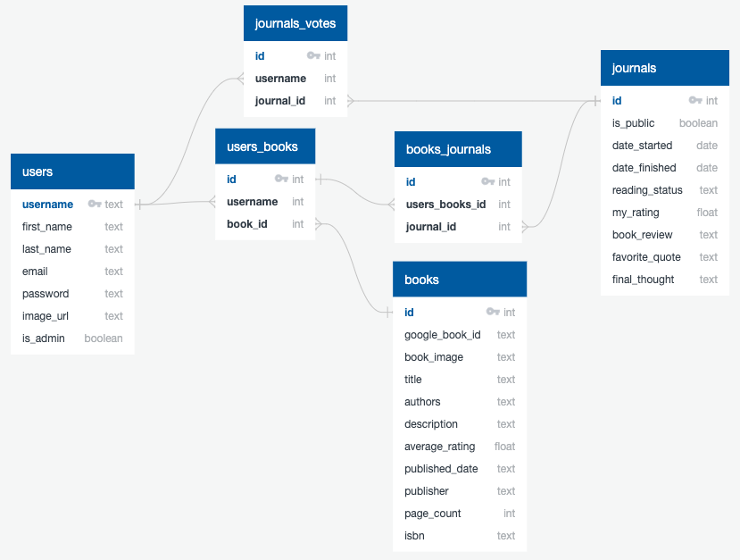

# BOOKmark my words API

A web application for bookworms to help keep track of the book they read, finished and will read in the futre. It allows users to create a journal for each book to summarize their readings and share with other readers. 

## External API 

This external API provides the books data needed for the BOOKmark my words project. 
Google Book API - https://developers.google.com/books

## API Documentation

## Database Schema 

